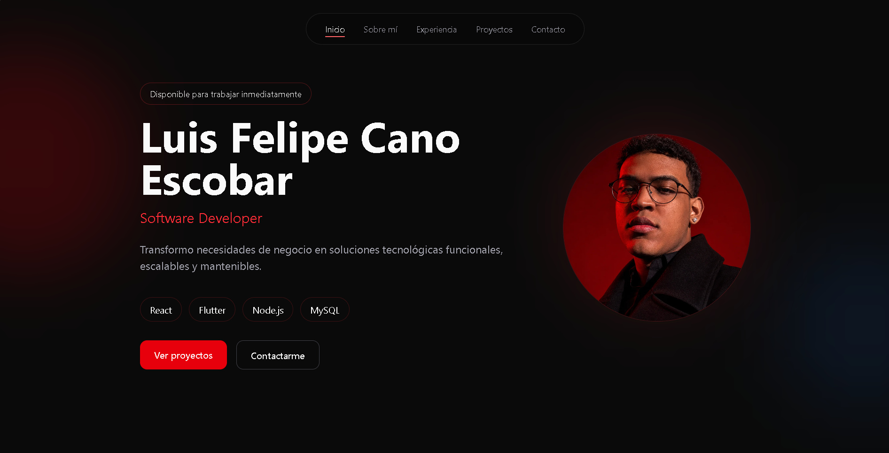
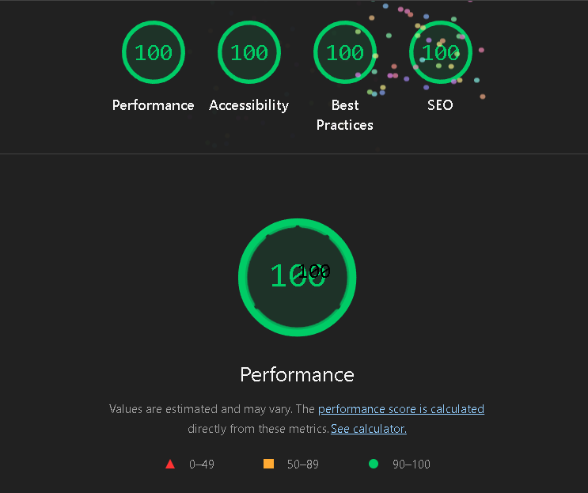

# Luis Felipe Cano Escobar — Portafolio Profesional

Frontend & Mobile Developer

[Live Demo](#) • [LinkedIn](https://www.linkedin.com/in/felipe-escobar-24187b2a7/) • [CV](./public/CV%20LUIS%20FELIPE.pdf)



**About**

Portfolio profesional construido para exponer proyectos reales, experiencia en liderazgo técnico y competencias en tecnologías modernas de frontend y mobile.

**Tech Stack**


**Características principales**

- Diseño responsive y móvil-first
- Animaciones suaves con Framer Motion
- Ruteo con React Router
- Componentes reutilizables y arquitectura por capas
- Optimizado para performance y accesibilidad

**Arquitectura (resumen)**

```
src
├── app
│   └── store
│       └── useThemeStore.js
├── assets
│   └── projects
├── components
│   ├── hero
│   ├── navbar
│   └── projects
├── data
│   ├── personalInfo.js
	└── projects.js
├── routes
│   └── AppRouter.jsx
├── layouts
└── styles
```

**Proyectos destacados**

- Sistema Integral de Control Académico — Full Stack (React, TypeScript, Node.js, MySQL)
- XISTIAPP — Mobile (Flutter, BLoC, Riverpod)
- Aquí Creamos — Frontend (React, Tailwind CSS)

Para detalles y links a repositorios y demos, ver [src/data/projects.js](src/data/projects.js).

**Lighthouse (sugerencia)**

Incluye aquí los resultados del audit de Lighthouse. Puedes ejecutar la auditoría en Chrome DevTools → Lighthouse y pegar los resultados.

- Performance: REEMPLAZAR_POR_RESULTADO
- Accessibility: REEMPLAZAR_POR_RESULTADO
- Best Practices: REEMPLAZAR_POR_RESULTADO
- SEO: REEMPLAZAR_POR_RESULTADO



**Instalación y ejecución (desarrollo)**

```bash
git clone <REPO_URL>
cd my-portfolio-react
npm install
npm run dev
```

Accede a http://localhost:5173 por defecto.

**Scripts útiles**

- `npm run dev` — inicia servidor de desarrollo (Vite)
- `npm run build` — construye versión de producción
- `npm run preview` — sirve la build localmente
- `npm run lint` — corre ESLint

**Configuración y deploy**

Recomendado: desplegar en Vercel o Netlify (Vite es compatible). Para GitHub Pages, usar `npm run build` y publicar la carpeta `dist`.

**Dónde poner las capturas / imágenes**

- Reemplaza `./public/CAPTURA_PRINCIPAL.png` con la captura completa de la home (pantalla completa, buena resolución).
- Reemplaza `./public/CAPTURA_LIGHTHOUSE.png` con la captura del informe Lighthouse.
- Para cada proyecto en `src/assets/projects/*/cover.webp`, guarda una captura en mayúsculas `CAPTURA_PROYECTO_<N>.png` si quieres mostrarlas en el README.

COLOCA_LAS_IMAGENES_AQUI

**Estructura técnica detallada**

- Frontend: React 19 + Vite
- Estilos: Tailwind CSS
- Estado global: Zustand (tema)
- Animaciones: Framer Motion
- Iconografía: Lucide + react-icons
- Ruteo: react-router-dom
- Linter: ESLint

**Cómo contribuir**

1. Haz fork del repositorio
2. Crea una branch: `feature/mi-cambio`
3. Abre un PR describiendo el cambio

**Contacto**

- Nombre: Luis Felipe Cano Escobar
- Email: luis1401cano2005@gmail.com
- GitHub: https://github.com/Escobar1401

----

Si quieres, puedo:

- Ejecutar una auditoría Lighthouse y pegar los resultados en el README
- Generar capturas (si me indicas cómo prefieres las imágenes)
- Publicar el sitio en Vercel (si me das acceso o instrucciones)

Archivo actualizado: [README.md](README.md)
# React + Vite

This template provides a minimal setup to get React working in Vite with HMR and some ESLint rules.

Currently, two official plugins are available:

- [@vitejs/plugin-react](https://github.com/vitejs/vite-plugin-react/blob/main/packages/plugin-react) uses [Oxc](https://oxc.rs)
- [@vitejs/plugin-react-swc](https://github.com/vitejs/vite-plugin-react/blob/main/packages/plugin-react-swc) uses [SWC](https://swc.rs/)

## React Compiler

The React Compiler is not enabled on this template because of its impact on dev & build performances. To add it, see [this documentation](https://react.dev/learn/react-compiler/installation).

## Expanding the ESLint configuration

If you are developing a production application, we recommend using TypeScript with type-aware lint rules enabled. Check out the [TS template](https://github.com/vitejs/vite/tree/main/packages/create-vite/template-react-ts) for information on how to integrate TypeScript and [`typescript-eslint`](https://typescript-eslint.io) in your project.
